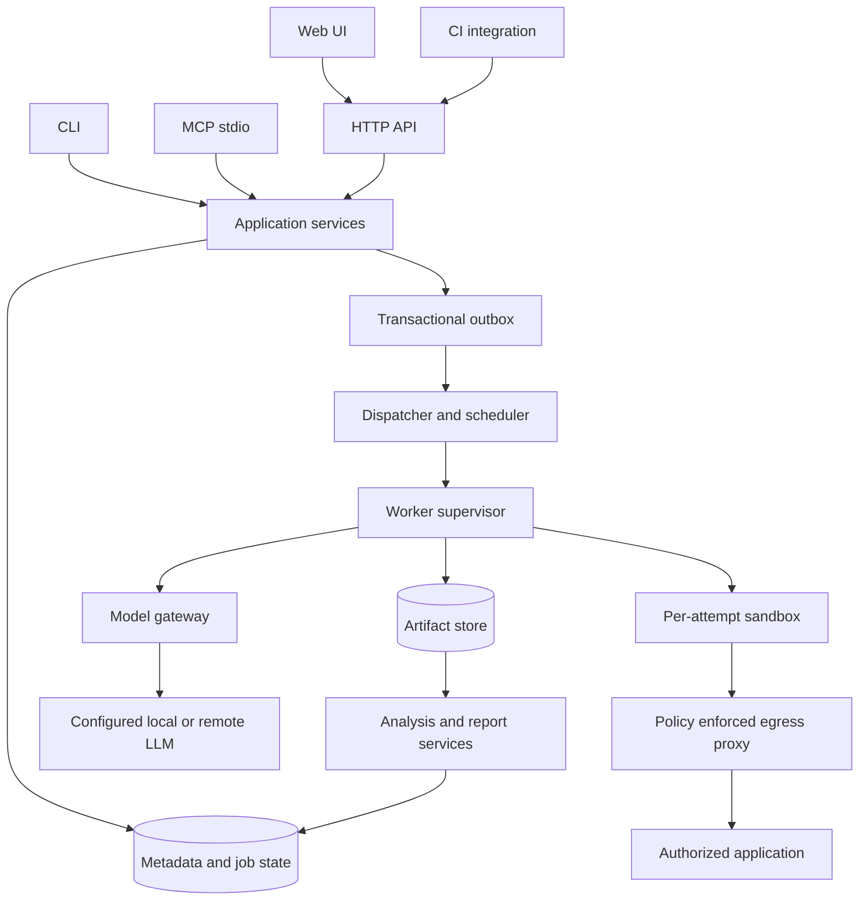

# 02 — Arquitetura, componentes e decisões

## 1. Estilo arquitetural

**Monólito modular com workers isolados**, não microserviços precoces. CLI local chama os mesmos application services que o servidor REST. MCP chama services locais ou cliente REST conforme perfil. Orchestrator nunca executa código de teste em seu processo. Worker supervisor confiável provisiona sandbox; código do projeto roda dentro dela. Model gateway fica fora do sandbox e disponibiliza somente chamadas de modelo autorizadas, sem entregar chave do provedor ao teste.



## 2. Limites de módulos

| Módulo | Responsabilidade | Não pode fazer |
|---|---|---|
| `contracts` | schemas, enums, wire DTOs, validação e erros | depender de banco/framework web |
| `domain` | identidade/revisões, seleção, dependências, política de verdict | I/O de rede, browser, filesystem |
| `application` | transações, autorização, jobs, comandos/query | executar código não confiável |
| `persistence` | SQLite/PostgreSQL repos, migrations, outbox | modificar conteúdo imutável |
| `planner` | fontes, mapa, requisitos, proposals, diff scope | promover comportamento observado a requisito desejado sem origem |
| `model-gateway` | provider capabilities, budgets, structured output, audit | fallback externo silencioso ou armazenar segredo em prompts |
| `worker-supervisor` | lease, sandbox, timeout/cancel, secret injection, artifacts | aceitar alteração de política do código testado |
| `runner-playwright` | ações/assertions, traces, eventos de step | publicar passed ignorando runner supervisor |
| `runner-http` | requests determinísticos, schema, captures | usar eval na interpolação |
| `runner-python` | pytest/Playwright Python/Schemathesis adapter | instalar dependências arbitrárias durante run |
| `evidence` | hashes, snapshots, bundle, redaction | mesclar últimos artefatos de runs diferentes |
| `analysis` | rules/LLM hypothesis, failure kind, healing proposal | sobrescrever resultado terminal |
| `reporting` | JSON/HTML/Markdown/JUnit/Allure export | recalcular verdict de fonte divergente |
| `cli`, `mcp`, `api`, `web` | adaptar interfaces | regra exclusiva invisível às demais superfícies |
| `integrations` | webhook/CI/notifiers/issue trackers | despachar fora de autorização/budget |

## 3. Organização proposta do código

```text
apps/
  cli/
  server/
  web/
  worker/
  mcp/
packages/
  contracts/
  domain/
  application/
  persistence/
  planner/
  model-gateway/
  evidence/
  reporting/
  runner-playwright/
  runner-http/
  integrations/
python/
  testmaster_runner/
containers/
  browser/
  python/
  egress-proxy/
fixtures/
  reference-app/
  reference-api/
  adversarial-targets/
evals/
  corpus/
  scoring/
```

Esta árvore é destino arquitetural, não exige criar pacotes vazios no primeiro commit. Extrair pacote quando houver implementação e fronteira testável. Workspace pnpm, build TypeScript e Python com `uv.lock`; versions pinadas. React/Vite para web, Fastify para API, SQLite driver mantido e PostgreSQL `pg`; schemas compartilhados não serializam tipos internos do banco.

## 4. Perfis

### Local (M1)

- CLI + dispatcher local em subprocesso controlado; metadata SQLite WAL; workspace por usuário.
- Browser/HTTP em Docker rootless. Proxy host autoriza origem local exata; socket não exposto a outros peers. Ver SEC para DNS/origin enforcement.
- `--wait` acompanha; `runId` persistido antes do filho começar. Detached exige supervisor persistente `testmaster worker start`; ausência dele é erro de precondição, não spawn oculto que morre com terminal.
- Sem HTTP server necessário; web opcional em loopback com session token.
- Dados grandes em filesystem; banco só metadata/referências e valores pequenos mascarados.

### Team self-hosted (M4)

- API stateless, PostgreSQL, object storage S3-compatible, workers dedicados e dispatcher.
- PostgreSQL é fonte autoritativa de job state. Queue por claim `SKIP LOCKED` + lease basta inicialmente; Redis/BullMQ só mediante evidência de gargalo, nunca segunda fonte do estado.
- Secrets cifrados com envelope encryption e key externalizada; reverse proxy TLS e RBAC. Identidade local de equipe em M4; federação OIDC/SAML e SCIM em M6.
- Deploy Compose de referência com serviço backup/restore documentado; Kubernetes opcional M5 após limites e runbook.

### Remote/multi-worker (M5)

- Worker labels por rede/browser/arquitetura, fila fairness por workspace e cap por target.
- Worker privado outbound não precisa expor rede local publicamente. Relay opcional para cloud worker chegar a loopback autorizado.
- Host de controle e hosts de execução separados. Multi-tenant adversarial precisa isolamento de VM/microVM ou host dedicado: container rootless sozinho não é promessa de isolamento forte.

## 5. Sequências

### Execute

1. Resolver seleção/revisões/ambiente e validar capabilities.
2. Verificar autorização, destino, auth refs, DAG e orçamento; não fazer login/probe destrutivo nesta fase.
3. Transação cria Run/BatchRun + budget reservation + outbox; idempotency receipt retornado.
4. Dispatcher adquire lease com fencing token e snapshot imutável.
5. Supervisor preflight de conectividade controlada, provisiona contexto e resolves secrets mínimos.
6. Runner emite eventos ordenados; supervisor persiste batches limitados, recebe artifacts em stream.
7. Cleanup por recursos realmente registrados; independência entre verdict de assertion e resultado cleanup.
8. Finalizar snapshot/manifest; regra determinística escolhe outcome; análise opcional gera hipótese separada.
9. Compare-and-set terminal + outbox result ready; reporters/notifiers não podem apagar resultado se falharem.

### Generate

Fonte versionada → parse determinístico → extração com proveniência → requirement conflicts → feature map → exploration observada → proposal batch → structural/semantic validation → review → TestRevision draft → sandbox verification → approved/failed draft. “Falhou” no produto não invalida teste que detectou bug real; aprovação depende da qualidade do oracle, não de ficar verde.

### Heal

Run failed → causa provável sustentada → revision candidate/diff → policy/human approval → novo Run replay → original failed preservado → candidate eligible para promoção com compare-and-set sobre revisão ativa. Se alguém editou no meio, conflito de revisão, não sobrescrita.

## 6. Decisões arquiteturais

| ADR | Decisão | Alternativa rejeitada / razão |
|---|---|---|
| ADR-001 | Core TS + Playwright TS, Python adapter explícito | Tudo Python reduziria integração CLI/SDK TS; só TS excluiria suites Python exportadas e Schemathesis |
| ADR-002 | SQLite local, PG servidor | Exigir Redis/PG para uma pessoa prejudica local-first; dual engines requer conformance de transação/JSON/time |
| ADR-003 | Plano declarativo e código exportável | DSL proprietária não exportável aumenta lock-in; linguagem natural pura impede replay auditável |
| ADR-004 | Separar planning/action/oracle/analysis | Um modelo executando e aprovando seu próprio trabalho facilita false pass |
| ADR-005 | Strict replay como base de regressão | Healing transparente pode mascarar mudança real e destrói comparabilidade |
| ADR-006 | Artefatos content-addressed por namespace tenant | Arquivos por “latest” criam corrida; dedupe global vaza correlação cross-tenant |
| ADR-007 | API REST+event stream, não event sourcing total | Eventos para progresso/audit; estado transacional mais simples para consulta e recuperação |
| ADR-008 | Reusar Playwright, avaliar Stagehand/browser-use como adapters | Fork de browser agent como core importaria defaults de healing/segredos e duplicaria engine |
| ADR-009 | BrowserGym/WebArena para eval complementar | Task completion benchmark não mede bug detection nem substitui corpus próprio |
| ADR-010 | Exporters JUnit e Allure, UI própria do domínio | Allure resolve relatório, não review/PRD/segredos/DAG/orchestration |
| ADR-011 | Licença recomendada Apache-2.0 | Patentes expressas e compatibilidade ampla; AGPL pode ser decisão comercial do mantenedor, não pressuposta |
| ADR-012 | Nenhum requisito de cloud proprietária | Serviços opcionais substituíveis por infra local; model local pode ter limitações explicitadas |

## 7. Portas de extensão

```ts
interface RunnerAdapter {
  readonly id: string;
  readonly apiVersion: "1.0.0";
  capabilities(): RunnerCapabilities;
  validate(input: ExecutionSnapshot): ValidationIssue[];
  execute(input: ExecutionSnapshot, context: RunnerContext): AsyncIterable<RunnerEvent>;
  cancel(attemptId: string): Promise<CancelReceipt>;
}
interface ModelProvider {
  capabilities(model: string): Promise<ModelCapabilities>;
  generate(request: ModelRequest, signal: AbortSignal): Promise<ModelResponse>;
}
interface ArtifactStore {
  put(stream: AsyncIterable<Uint8Array>, policy: ArtifactPolicy): Promise<StoredArtifact>;
  open(artifactId: string): Promise<AsyncIterable<Uint8Array>>;
  delete(artifactId: string): Promise<DeletionReceipt>;
}
```

Interfaces conceituais; DTOs finais devem ser gerados do contrato normativo. `RunnerContext` só oferece capabilities de log/artifact/secret já limitadas; plugin não recebe instância do DB ou chave mestra. Instalação de plugin requer versão/checksum/trust decision. Conformance exige cancel real, egress restrictions, retry identity, schema, step ordering e redaction. Sem hot-load de URL enviada pelo modelo.

## 8. Aceite arquitetural

- ARCH-001: um caso Playwright e um HTTP rodam por CLI local e servidor com mesma revisão/mesmo schema de resultado.
- ARCH-002: substituir provedor LLM não altera runner e replay não importa SDK de modelo.
- ARCH-003: matar processo cliente após receipt permite recuperar Run; matar sandbox não deixa runner órfão.
- ARCH-004: falha de notification/storage export não altera assertion verdict; incompletude de evidência aparece no gate.
- ARCH-005: nenhuma dependência de TestSprite API/domain é necessária para gerar, executar ou exportar.
